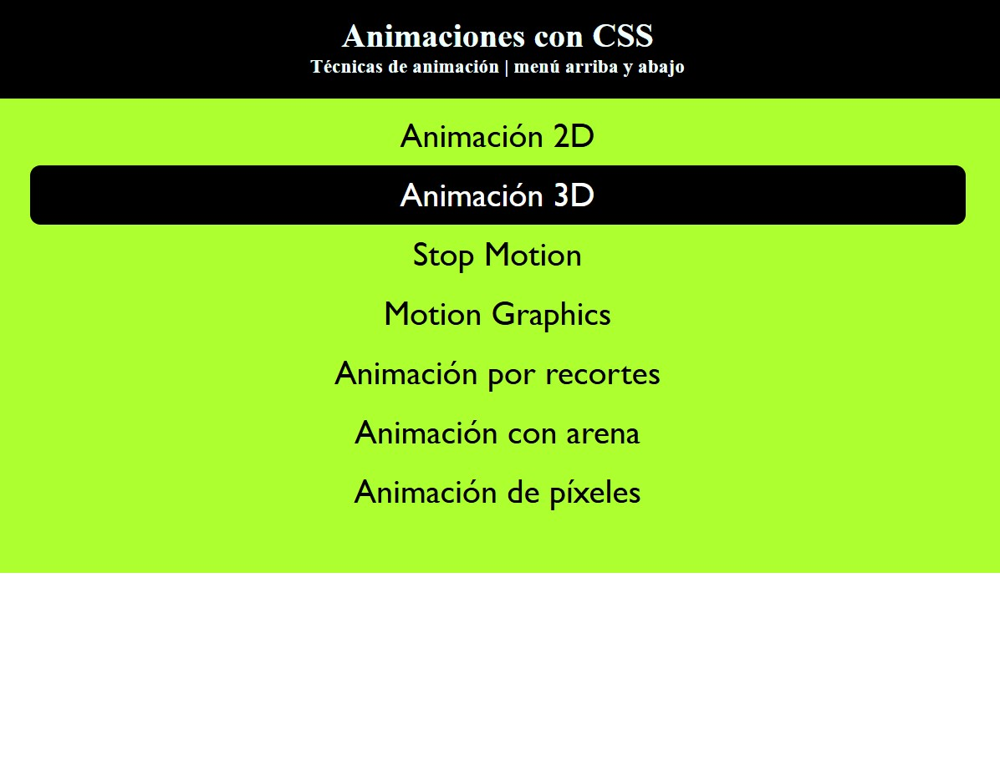

# Animaciones con CSS
Muestra una animacón de rebote en el menú, aparece desde arriba, por debajo de la cabecera y se esconde de nuevo.
- Regla `@keyframes` con la función `translateY()` para el eje `y`.
---

