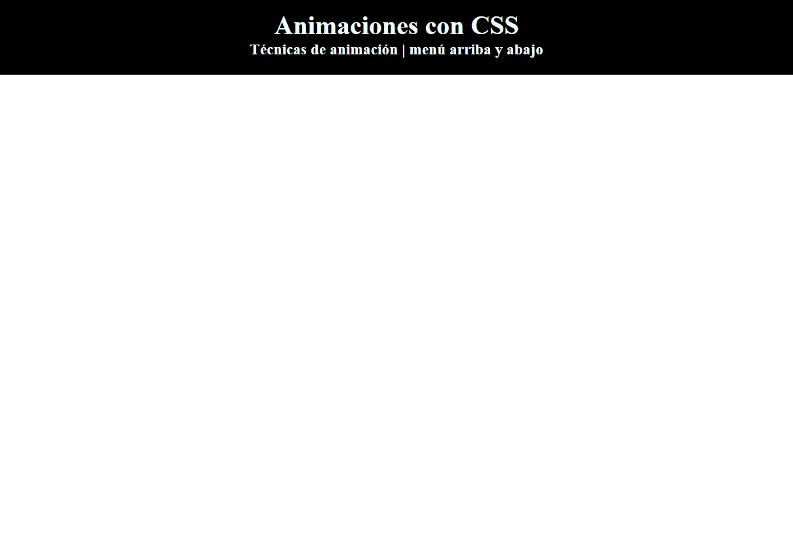

# Animaciones con CSS
Muestra una animacón en el menú que aparece desde arriba y se esconde de nuevo con el valor `infinite`.
- Regla `@keyframes` con la función `translateY()` para el eje `y`.
---

