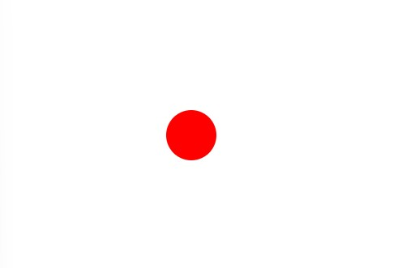
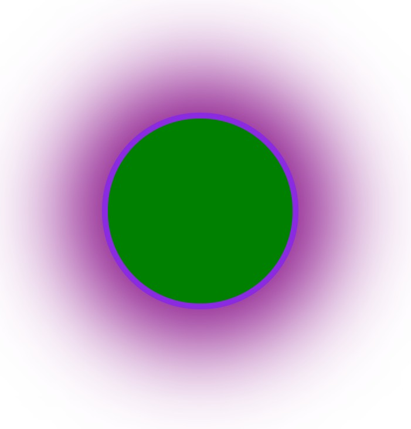

# Transiciones en CSS

Producir un efecto de transicion con las propiedades de `transition`.
- Aceleraciones de curva `cubic-bezier` y lineal `steps(n)` en la propiedad `transition-timing-function`.
- La transición ocurre entre los diferentes estados de un elemento.
- Iniciar la transición con el pseudo-elemento `:hover`.
---

