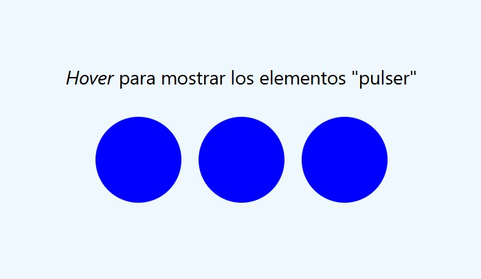
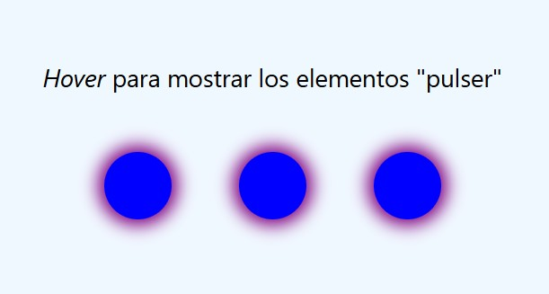

# Transiciones en CSS
Las transiciones pueden tener un delay. En este caso se utiliza la propiedad `transition-delay`. Además he añadido la regla `@starting-style` para crear un efecto de opacidad al carga la página.

- Al utulizar el pseudo `:hover` en la sección se activan las transiciones de los elementos `pulser` con un retraso entre los tres círculos, lo que produce un efecto de transición suave.
---

