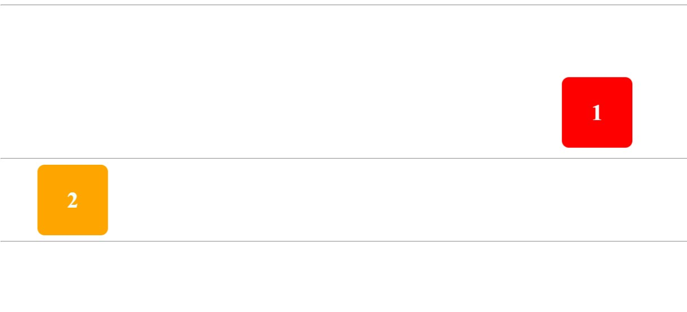

# Animaciones con CSS
Anima dos rectángulos que se mueven por la pantalla. Cuando pasas el cursor sobre alguno de ellos, la animación se pausa y cambia el filtro.
- Regla `@keyframes` con la propiedad `transform` y función `translate()` por los ejes `x`, `y`.
---
